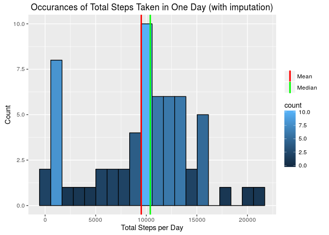

# Reproducible Research: Peer Assessment 1


## Loading and preprocessing the data

### Globals
Our code presumes that there is some structure to the directory in which the
analysis is being performed. This structure is defined here.

```r
tidydata.dir = "data";
rawdata.dir = "raw";

#   So, it turns out that the default figure path for me was made out of
#   INSANITY.
knitr::opts_chunk$set( fig.path = "figure/" );
```

### GetRawFile function
This function would normally appear in an external R-code file, but for clarity
I have included it here. This function will fetch a file from an online
location, timestamp it, and then return the timestamp. It only does this if the
`output.file` doesn't already exist. If it does, then it will merely return the
timestamp for the already saved raw data set.

This function will also create the raw data directory, if necessary.

```r
GetRawFile = function( url, output.file = "RawData" )
{
    if ( !dir.exists( rawdata.dir ) )
    {
	dir.create( rawdata.dir, recursive = TRUE );
    }

    output.file = file.path( rawdata.dir, output.file );

    timestamp = "";
    timestamp.file = paste( output.file, "timestamp", sep = "." );

    #   Get the file from the Webosphere.
    if ( !file.exists( output.file ) )
    {
	message( "Downloading raw data." );
	timestamp = date();
	download.file(
	    url = url,
	    destfile = output.file
	);
	writeLines( timestamp, timestamp.file );
    }
    else
    {
	message( "Using existing raw data." );
	timestamp = readLines( timestamp.file );
    }

    #   We're going to try to unzip the raw data file. If it doesn't work and
    #	we get a warning, we are going to ignore it. That should only happen if
    #	the unzipped files already exist, or in the case that the raw data file
    #	was not zipped to begin with. At least, we hope those are the only
    #	conditions where a warning would be generated.
    suppressWarnings(
	unzip( output.file, overwrite = FALSE, exdir = rawdata.dir )
    );

    #	An argument could be made that unzipping the file should really be done
    #	in a function that tidies the data. After all, the files paths
    #	generated by this call are needed in any data tidying routine, to read
    #	the files in properly for processing. But, I don't think there is any
    #	truly generic data tidying routine possible. In every case where you
    #	are attempting to tidy data, you need to already have knowledge of the
    #	filenames for each raw data file outside of any programmatic generation
    #	of that information simply because each file will likely need very
    #	different treatment. So, there really isn't any need to pass the output
    #	of the unzip routine along. Rather, what is important here is that
    #	the code for downloading and unzipping files leaves the directory
    #	structure in a set state that can then be exploited by the software
    #	developer in writing a data tidying routine.

    return(timestamp);
}
```

Now, we actually will get and timestamp the raw data.

```r
cat(
    "Raw data downloaded on",
    GetRawFile("https://d396qusza40orc.cloudfront.net/repdata%2Fdata%2Factivity.zip"),
    "\n"
);
```

```
## Using existing raw data.
```

```
## Raw data downloaded on Thu Apr  7 03:57:54 2016
```

### TidyData function
This function will, if necessary, prepare the dataset for use in the analysis
and save off the data to an rds file. It returns a dplyr data frame, either the
data frame it just generated, or one that was already available. It also
creates the `tidydata.dir` if it does not already exist.

Note that this function cannot simply be dropped into another program without
significant changes, because the process of tidying data is too intimate to the
raw data format (in general).

We are going to be using the `data.table` package for this.

```r
library(data.table);
TidyData = function( rawfile = "RawData", tidyfile = "TidyData.rds" )
{
    retval = NA;
    retfile = file.path( tidydata.dir, tidyfile );

    if ( !dir.exists( tidydata.dir ) )
    {
	dir.create( tidydata.dir, recursive = TRUE );
    }

    if ( !file.exists( retfile ) )
    {
	message( "Creating tidy data set." );
	retval = fread( file.path( rawdata.dir, "activity.csv" ) );

	retval$date = as.Date( retval$date );

	saveRDS( retval, retfile );

	return( invisible( retval ) );
    }
    else
    {
	message( "Reading saved tidy data set." );
	return( invisible( readRDS( retfile ) ) );
    }
}
```
Now, we actually prepare the data and take a quick look at it.


```r
steps.table= TidyData();
```

```
## Reading saved tidy data set.
```

```r
str(steps.table);
```

```
## Classes 'data.table' and 'data.frame':	17568 obs. of  3 variables:
##  $ steps   : int  NA NA NA NA NA NA NA NA NA NA ...
##  $ date    : Date, format: "2012-10-01" "2012-10-01" ...
##  $ interval: int  0 5 10 15 20 25 30 35 40 45 ...
##  - attr(*, ".internal.selfref")=<externalptr>
```

```r
head(steps.table);
```

```
##    steps       date interval
## 1:    NA 2012-10-01        0
## 2:    NA 2012-10-01        5
## 3:    NA 2012-10-01       10
## 4:    NA 2012-10-01       15
## 5:    NA 2012-10-01       20
## 6:    NA 2012-10-01       25
```

## What is mean total number of steps taken per day?

To calculate the total steps taken per day, we can group our `steps.table` by
date. We can also take a look at the distribution of the total steps by
generating a histogram.


```r
steps.by.date =
    steps.table[, list(total.steps = sum(steps, na.rm = TRUE)), by = date];

head( steps.by.date );
```

```
##          date total.steps
## 1: 2012-10-01           0
## 2: 2012-10-02         126
## 3: 2012-10-03       11352
## 4: 2012-10-04       12116
## 5: 2012-10-05       13294
## 6: 2012-10-06       15420
```

```r
summary( steps.by.date$total.steps, na.rm = TRUE );
```

```
##    Min. 1st Qu.  Median    Mean 3rd Qu.    Max. 
##       0    6778   10400    9354   12810   21190
```

```r
steps.mean.by.date = steps.by.date[ , mean(total.steps, na.rm = TRUE) ];
steps.median.by.date = steps.by.date[ , median(total.steps, na.rm = TRUE) ];

library( ggplot2 );

gg.hist.steps =
    ggplot( steps.by.date, aes( total.steps ), show.legend = TRUE ) +
    geom_histogram( binwidth = 30 ) +
    labs( x = "Total Steps per Day", y = "Count" ) +
    labs( title = "Occurances of Total Steps Taken in One Day" ) +
    geom_vline(
	aes(
	    xintercept = steps.mean.by.date,
	    color = "Mean"
	),
	size = 1,
	show.legend = TRUE
    ) +
    geom_vline(
	aes(
	    xintercept = steps.median.by.date,
	    color = "Median"
	),
	size = 1,
	show.legend = TRUE
    ) +
    scale_color_manual(
	name = "",
	values = c( Mean = "green", Median = "blue" )
    );
	       

print( gg.hist.steps );
```


The mean and median total steps per day are:


```r
cat( "The mean total steps per day is", steps.mean.by.date, "\n" );
cat( "The median total steps per day is", steps.median.by.date, "\n" );
```

```
## The mean total steps per day is 9354.23 
## The median total steps per day is 10395
```

## What is the average daily activity pattern?

To determine average daily activity patterns, we can simply group by interval.


```r
steps.by.interval =
    steps.table[, list(mean.steps = mean(steps, na.rm = TRUE)), by = interval];

head( steps.by.interval );
```

```
##    interval mean.steps
## 1:        0  1.7169811
## 2:        5  0.3396226
## 3:       10  0.1320755
## 4:       15  0.1509434
## 5:       20  0.0754717
## 6:       25  2.0943396
```

```r
summary( steps.by.interval$mean.steps, na.rm = TRUE );
```

```
##    Min. 1st Qu.  Median    Mean 3rd Qu.    Max. 
##   0.000   2.486  34.110  37.380  52.830 206.200
```

```r
steps.max.interval =
    steps.by.interval[ mean.steps == max(mean.steps, na.rm = TRUE), interval ];

library( ggplot2 );

gg.mean.steps =
    ggplot( steps.by.interval, aes( interval, mean.steps ) ) +
    geom_line( color = "cyan3" ) +
    labs( x = "Interval", y = "Number of Steps" ) +
    labs( title = "Average Daily Activity Pattern" );

print( gg.mean.steps );
```


```r
cat(
    "The maximum average steps occurs during the interval at minute",
    steps.max.interval,
    "\n"
);
```

```
## The maximum average steps occurs during the interval at minute 835
```

## Imputing missing values

There may be some bias introduced into the dataset due to missing values. So,
how many missing values do we have?


```r
cat( "Missing steps", sum(is.na( steps.table$steps )), "\n");
cat( "Missing dates", sum(is.na( steps.table$date )), "\n");
cat( "Missing intervals", sum(is.na( steps.table$interval )), "\n");

cat(
    "Proportion of missing steps is",
    sum( is.na( steps.table$steps ) )/nrow( steps.table ),
    "\n"
);
```

```
## Missing steps 2304 
## Missing dates 0 
## Missing intervals 0 
## Proportion of missing steps is 0.1311475
```
So, only steps are missing from the dataset, which is good, but over 13% of
entries for steps are `NA`, which may be very bad. We can estimate what these
missing values might be by replacing them with the median steps for that
interval. Apparently both mean and median are not good choices for imputation,
but in this assignment we are allowed to use simple imputed values. I choose
median because this dataset appears to have some skew in it.


```r
steps.table.fixed = data.table::copy(steps.table);
steps.table.fixed[ ,
    steps := ifelse(is.na(steps), median(steps, na.rm = TRUE), steps),
    by = interval
];

str(steps.table.fixed);
```

```
## Classes 'data.table' and 'data.frame':	17568 obs. of  3 variables:
##  $ steps   : int  0 0 0 0 0 0 0 0 0 0 ...
##  $ date    : Date, format: "2012-10-01" "2012-10-01" ...
##  $ interval: int  0 5 10 15 20 25 30 35 40 45 ...
##  - attr(*, ".internal.selfref")=<externalptr>
```

```r
summary(steps.table$steps);
```

```
##    Min. 1st Qu.  Median    Mean 3rd Qu.    Max.    NA's 
##    0.00    0.00    0.00   37.38   12.00  806.00    2304
```

```r
summary(steps.table.fixed$steps);
```

```
##    Min. 1st Qu.  Median    Mean 3rd Qu.    Max. 
##       0       0       0      33       8     806
```
Now, we create a histogram similar to the one created earlier.


```r
steps.by.date.fixed =
    steps.table.fixed[ , list(total.steps = sum(steps)), by = date ];

head( steps.by.date.fixed );
```

```
##          date total.steps
## 1: 2012-10-01        1141
## 2: 2012-10-02         126
## 3: 2012-10-03       11352
## 4: 2012-10-04       12116
## 5: 2012-10-05       13294
## 6: 2012-10-06       15420
```

```r
summary( steps.by.date.fixed$total.steps );
```

```
##    Min. 1st Qu.  Median    Mean 3rd Qu.    Max. 
##      41    6778   10400    9504   12810   21190
```

```r
steps.mean.by.date.fixed = steps.by.date.fixed[ , mean(total.steps) ];
steps.median.by.date.fixed = steps.by.date.fixed[ , median(total.steps) ];

library( ggplot2 );

gg.hist.steps.fixed =
    ggplot( steps.by.date.fixed, aes( total.steps ), show.legend = TRUE ) +
    geom_histogram( binwidth = 30 ) +
    labs( x = "Total Steps per Day", y = "Count" ) +
    labs( title = "Occurances of Total Steps Taken in One Day (with imputation)" ) +
    geom_vline(
	aes(
	    xintercept = steps.mean.by.date.fixed,
	    color = "Mean"
	),
	size = 1,
	show.legend = TRUE
    ) +
    geom_vline(
	aes(
	    xintercept = steps.median.by.date.fixed,
	    color = "Median"
	),
	size = 1,
	show.legend = TRUE
    ) +
    scale_color_manual(
	name = "",
	values = c( Mean = "green", Median = "blue" )
    );
	       

print( gg.hist.steps.fixed );
```



Our new mean and median are:


```r
cat( "The mean fixed total steps per day is", steps.mean.by.date.fixed, "\n" );
cat(
    "The median fixed total steps per day is",
    steps.median.by.date.fixed,
    "\n"
);
```

```
## The mean fixed total steps per day is 9503.869 
## The median fixed total steps per day is 10395
```

To remind ourselves of the original values:

```r
cat( "The mean total steps per day is", steps.mean.by.date, "\n" );
cat( "The median total steps per day is", steps.median.by.date, "\n" );
```

```
## The mean total steps per day is 9354.23 
## The median total steps per day is 10395
```

So, imputation using the median by interval changes the mean total daily steps
so that it is slightly higher, by about 200 steps, and does not change the
median number of steps per day.

## Are there differences in activity patterns between weekdays and weekends?

We can determine this by creating a new factor for `steps.table`. 


```r
steps.table[ ,
    daytype :=
	ifelse(
	    weekdays(date) %in% c("Saturday","Sunday"),
	    "Weekend",
	    "Weekday"
	)
];
steps.table[ , daytype := factor(daytype) ];

str(steps.table);
```

```
## Classes 'data.table' and 'data.frame':	17568 obs. of  4 variables:
##  $ steps   : int  NA NA NA NA NA NA NA NA NA NA ...
##  $ date    : Date, format: "2012-10-01" "2012-10-01" ...
##  $ interval: int  0 5 10 15 20 25 30 35 40 45 ...
##  $ daytype : Factor w/ 2 levels "Weekday","Weekend": 1 1 1 1 1 1 1 1 1 1 ...
##  - attr(*, ".internal.selfref")=<externalptr>
```

```r
print(steps.table);
```

```
##        steps       date interval daytype
##     1:    NA 2012-10-01        0 Weekday
##     2:    NA 2012-10-01        5 Weekday
##     3:    NA 2012-10-01       10 Weekday
##     4:    NA 2012-10-01       15 Weekday
##     5:    NA 2012-10-01       20 Weekday
##    ---                                  
## 17564:    NA 2012-11-30     2335 Weekday
## 17565:    NA 2012-11-30     2340 Weekday
## 17566:    NA 2012-11-30     2345 Weekday
## 17567:    NA 2012-11-30     2350 Weekday
## 17568:    NA 2012-11-30     2355 Weekday
```

Let's see if `NA` values for steps are more prevalent in weekdays or weekends.


```r
steps.table[ daytype == "Weekday", sum(is.na(steps)) ]/5;
steps.table[ daytype == "Weekend", sum(is.na(steps)) ]/2;
```

```
## [1] 345.6
## [1] 288
```

It looks like there are more `NA` values in the weekdays which I think might
affect the results. So, instead, we'll use the fixed dataset. We will also
create a time series based on these factors.


```r
steps.table.fixed[ ,
    daytype :=
	ifelse(
	    weekdays(date) %in% c("Saturday","Sunday"),
	    "Weekend",
	    "Weekday"
	)
];
steps.table.fixed[ , daytype := factor(daytype) ];

str(steps.table.fixed);
```

```
## Classes 'data.table' and 'data.frame':	17568 obs. of  4 variables:
##  $ steps   : int  0 0 0 0 0 0 0 0 0 0 ...
##  $ date    : Date, format: "2012-10-01" "2012-10-01" ...
##  $ interval: int  0 5 10 15 20 25 30 35 40 45 ...
##  $ daytype : Factor w/ 2 levels "Weekday","Weekend": 1 1 1 1 1 1 1 1 1 1 ...
##  - attr(*, ".internal.selfref")=<externalptr>
```

```r
print(steps.table.fixed);
```

```
##        steps       date interval daytype
##     1:     0 2012-10-01        0 Weekday
##     2:     0 2012-10-01        5 Weekday
##     3:     0 2012-10-01       10 Weekday
##     4:     0 2012-10-01       15 Weekday
##     5:     0 2012-10-01       20 Weekday
##    ---                                  
## 17564:     0 2012-11-30     2335 Weekday
## 17565:     0 2012-11-30     2340 Weekday
## 17566:     0 2012-11-30     2345 Weekday
## 17567:     0 2012-11-30     2350 Weekday
## 17568:     0 2012-11-30     2355 Weekday
```

```r
steps.by.interval.daytype =
    steps.table.fixed[ ,
	list(mean.steps = mean(steps)),
	by = "interval,daytype"
];

head( steps.by.interval.daytype );
```

```
##    interval daytype mean.steps
## 1:        0 Weekday 2.02222222
## 2:        5 Weekday 0.40000000
## 3:       10 Weekday 0.15555556
## 4:       15 Weekday 0.17777778
## 5:       20 Weekday 0.08888889
## 6:       25 Weekday 1.31111111
```

```r
summary( steps.by.interval.daytype$mean.steps );
```

```
##    Min. 1st Qu.  Median    Mean 3rd Qu.    Max. 
##   0.000   1.617  24.020  34.670  55.390 205.400
```

```r
library( ggplot2 );

gg.mean.steps.fixed =
    ggplot( steps.by.interval.daytype, aes( interval, mean.steps ) ) +
    geom_line( aes( color = daytype), show.legend = FALSE ) +
    facet_grid( daytype ~ . ) +
    labs( x = "Interval", y = "Number of Steps" ) +
    labs( title = "Average Daily Activity Pattern" );

print( gg.mean.steps.fixed );
```


